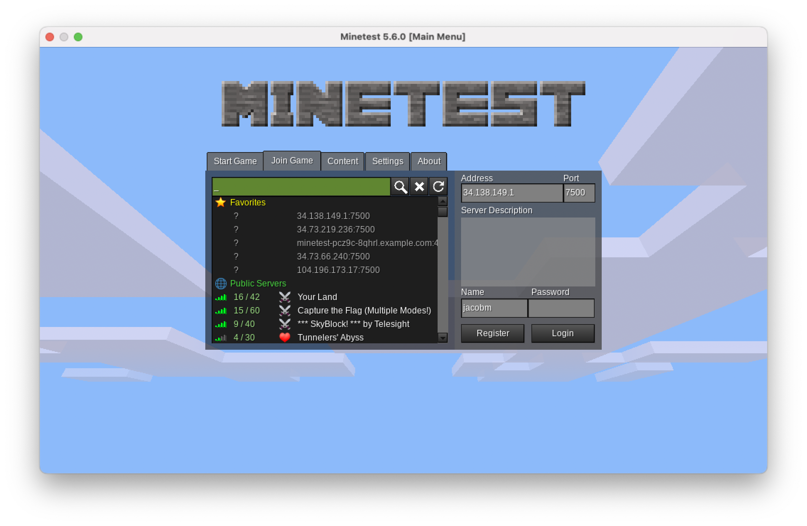
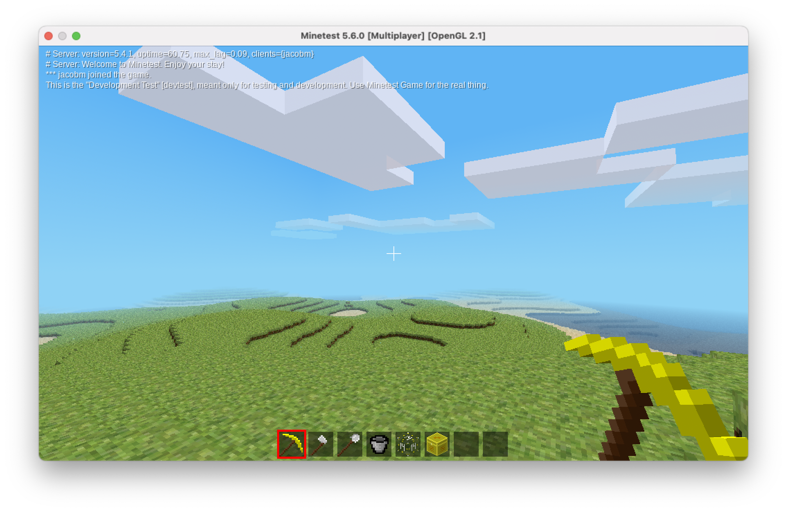

# Reliable, Repeatable, and Scalable Multi-cloud Application deployments with Anthos
This repository contains all the code used in the `Reliable, Repeatable, and Scalable Multi-cloud Application deployments with Anthos` talk at **Google Cloud: Next on the Road**

## Goals
This demo showcases how to use Anthos Config Management (ACM), specifically Config Sync, to deploy consistent configuration across Kubernetes clusters. These clusters can be in a single Cloud environment or span hybrid and multi-cloud environments.

All the infrastructure is stood up using Terraform. Once Terraform completes, ACM takes over to roll-out ArgoCD, Agones, cert-manager, and an NGINX ingress controller in all Kubernetes clusters spanning multiple clouds simultaneously.

## Set Up
This demo requires that you have access to a GCP project with the following APIs enabled:
- GKE Hub API
- Anthos Config Management API
- Anthos Multicloud API
- GKE Connect API
- Kubernetes Engine API

The terraform configurations below rely on user credentials for Azure, AWS, and GCP

Set up application default credentials for GCP:

```shell
gcloud auth application-default login
```

Login to the Azure CLI: 

```shell
az login
```

Set up AWS Access Credentials:

```shell
export AWS_ACCESS_KEY_ID="<access key id>"
export AWS_SECRET_ACCESS_KEY="<secret access key>"
```

## Deployment

Create a `terraform.tfvars` (Use the sample as a starting point)
```bash
cp terraform.tfvars.sample terraform.tfvars
```

Initalize Terraform to download all necessary modules and providers and initalize the backend.
```bash
terraform init
```

Apply the Terraform code to deploy Anthos Clusters in GCP, AWS and Azure cluster along with registering them with ACM to bootstrap the clusters with Agones.
```bash
terraform apply
```

> output
```bash
Outputs:

generate_gke_credentials = "gcloud container clusters get-credentials agones-cluster --zone us-east1-b --project wlkrahdvd89pzclh9poereuzmb1axq"

```

## Validate Deployment Status
Google provides a CLI tool called `nomos` which can be used to validate the status of Config Sync and ensure it has consolidated and applied the configuration successfully. `nomos` uses your kubeconfig to discover and authenticate against your clusters.

### Retrieve GKE Credentials
Use the output `generate_gke_credentials` from the Terraform apply to add the credentials to your kubeconfig.

### Retrieve Anthos on Azure Credentials
Use the output `generate_azure_credentials` from the Terraform apply to add the credentials to your kubeconfig.

### Retrieve Anthos on AWS Credentials
Use the output `generate_aws_credentials` from the Terraform apply to add the credentials to your kubeconfig.

### Using Nomos
```bash
nomos status
```

## Accessing Gameservers
Once your cluster is synced, you can view your gameservers:
```bash
kubectl get gameservers
```

> output

```bash
NAME                   STATE   ADDRESS         PORT   NODE             AGE
minetest-mt2ld-49qzw   Ready   35.231.211.56   7500   gke-agones-...   13s
minetest-mt2ld-676gk   Ready   34.138.86.152   7500   gke-agones-...   13s
minetest-mt2ld-xzq92   Ready   34.73.219.236   7500   gke-agones-...   13s
```

Download the [Minetest](https://www.minetest.net/downloads/) client and launch it.

Enter an IP address and port number and click `Register`.


Fill in a `Name` and `Password` and click `Register` to be launched into the game.
